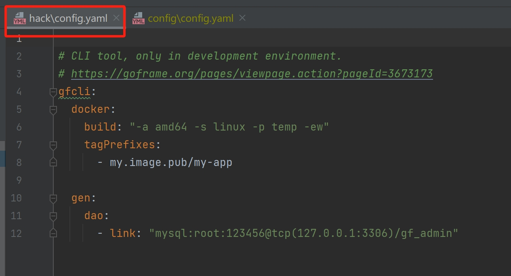
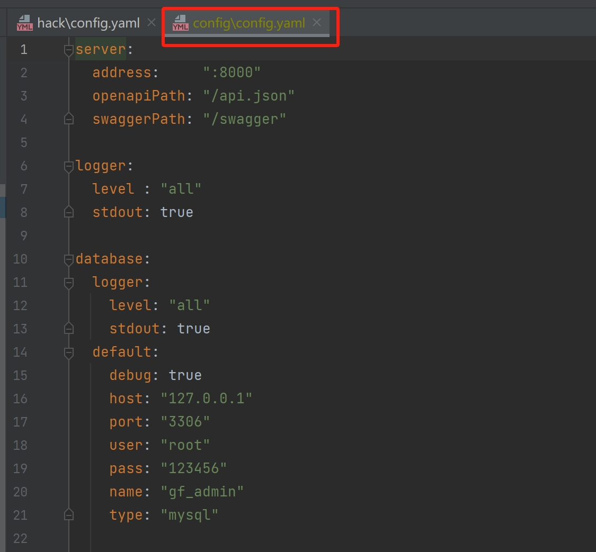

# 后端

后端主要使用的技术有go、[goframe](https://github.com/gogf/gf)、mysql

## 环境安装

### golang 安装

golang 版本 1.22.0 [点击下载](https://golang.google.cn/doc/install)，安装步骤省略，golang配置查看其它资料。

### mysql 安装

mysql 依赖版本8.0+ [点击下载](https://downloads.mysql.com/archives/installer/)，安装步骤省略

### 安装gf

```md
go install github.com/gogf/gf/cmd/gf/v2@latest
```

或者
[点击下载](https://github.com/gogf/gf/releases)

### Goframe

goframe [文档地址](https://goframe.org)

## 创建数据库

数据库名：自定义<br/>
字符集：utf8mb4<br/>
排序规则：utf8mb4_general_ci

## 项目下载执行

### clone

```md
git clone https://github.com/clgwxg/gf-naive-server.git
```

### 安装依赖

```md
go mod download
```

### 导入数据

把项目根目录里的gf_naive.sql文件导入创建的数据库里

### 修改项目数据库配置

修改项目所依赖的数据库配置文件，具体如何配置请查看goframe[文档](https://goframe.org)



### 开发环境执行

```md
gf run main.go
```
